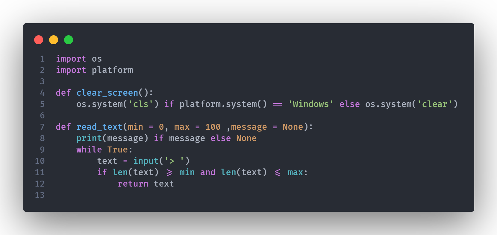

# Manager
## subtitulo

este programa esta siendo diseñado para gestionar bases de datos

~~~
Bloques
~~~

> Un país, una civilización se puede juzgar por la forma en que trata a sus animales.  — Mahatma Gandhi

---
***

[google][enlace]

[enlace]: google.com

[otro link][enlace]

[enlace en línea](http://www.google.com)

`caminar = caminando`

<code> caminar = caminando </code>

    caminar = caminando
    

![code.png][img]

[img]:./Documents/code.png "titulo de imagen"

esto es texto normal
